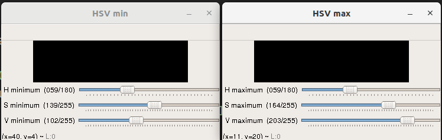

# Invisible
Python code for Invisible cloak like that in Harry Potter.

### Working video
https://www.youtube.com/watch?v=ByadweFAMRM

### For all colors
There are two frames for minimum and maximum value of the HSV values of a particular color.
The slider can be used to change values of H, S and V for making different colors to disappear according to users choice.

These sliders can be used to adjust the HSV values.
The value of HSV min must always be less than or equal to HSV max(for obvious reasons).
